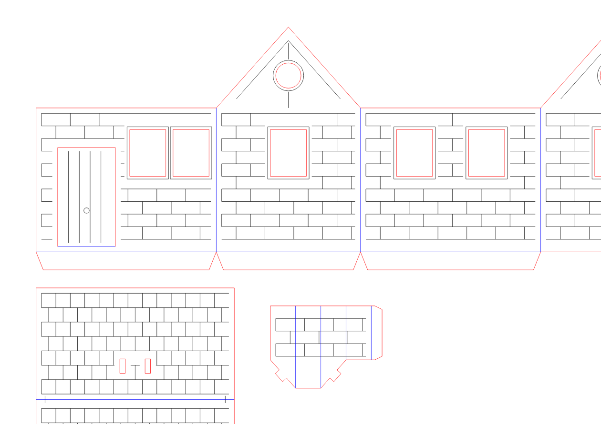

# Kraft House: A3 laser-cut papercraft house

## What this is

This is a paper house cut from one A3 sheet of 350gsm kraft card.
It makes three pieces:

- a wall strip with four walls and two gables
- a roof with two panels
- a small chimney box

When folded, the footprint is 100 mm × 80 mm. The height to the ridge is about 125 mm. The chimney sits higher.

## Files

- `house_a3.svg`: the cut file. Three layers keyed by stroke colour.
- `generate.py`: makes the SVG and checks its own geometry. Run with `python3 examples/kraft-house/generate.py`.
- `prepare_job.py`: builds a MeerK40t job and G-code from the SVG. Run with the repo venv: `.venv/bin/python examples/kraft-house/prepare_job.py examples/kraft-house/house_a3.svg --out-dir examples/kraft-house/output --json`.
- `output/house_a3_job.svg`, `output/house_a3.gcode`, and `output/house_a3_manifest.json`: prepared job artefacts (the manifest records file hashes, the material profile, and a settings fingerprint). Regenerate them after any change to the SVG.

Window frames are etched 1.5 mm outside each opening. The door sits left of centre with both front windows to its right, so no cut lines touch each other.

## Layer legend

| Layer | Colour | Job type | What it does |
| --- | --- | --- | --- |
| `cut` | `#FF0000` red | Cut through | Outer edges, window holes, door three sides, chimney slots |
| `score` | `#0000FF` blue | Score / fold | Fold lines, drawn as solid lines |
| `etch` | `#000000` black | Engrave | Bricks, shingles, timber frame, door planks, window frames |

All strokes are width 0.2 mm, fill none, and 1 unit equals 1 mm.

## How the folds work

The laser burns a shallow crease. The card folds away from the lasered face, so the crease opens on the outside.

- Wall corners: fold inward. The etched face stays on the outside.
- Roof ridge: fold so the etched shingles face out.
- Bottom tabs: fold inward.
- Door hinge: fold at the bottom so the door opens outward.

## Laser settings

These settings come from the bundled `kraft-350gsm` material profile, which the
`job prepare` command and this example wrapper both consume. Inspect them with:

    cli-anything-meerk40t materials show kraft-350gsm --machine sculpfun-s9

They are calibration starting points, not a guarantee for this batch of card. Test
them on a scrap piece of the same card first.

| Layer | Operation | Passes | Power (S) | Speed | Status |
| --- | --- | --- | --- | --- | --- |
| `cut` red #FF0000 | cut | 1 | 650 | 16 mm/s | estimated - ladder required |
| `score` blue #0000FF | engrave | 1 | 280 | 20 mm/s | tested |
| `etch` black #000000 | engrave | 1 | 380 | 40 mm/s | estimated - ladder required |

Before you cut the full sheet, run a small test square on scrap. Check that the cut goes through cleanly, the score creases without tearing, and the etch is the right darkness. Then run the full job.
## Sheet placement

The sheet is true A3, 420 mm × 297 mm, laid landscape. The example machine (Sculpfun S9) has 410 mm × 400 mm of travel. The sheet is 10 mm wider than the travel, so it cannot fit fully inside the working area.

All the lines the laser draws sit inside a 400 mm × 280 mm window, centred on the sheet. That leaves about 10 mm of untouched margin on each side. So the job fits, but the sheet itself sticks out.

Handle the extra width one of two ways:

- The S9 is an open frame. Let the sheet edges pass under the frame rails. The overhang must lie flat on a surface at the same height, or the sheet will bow and the focus will drift.
- Or trim the sheet to 410 mm wide or less before cutting. Then it fits inside the travel with no overhang.

Line up the machine origin with the start of the working window, not the sheet corner. Machine (0,0) maps to the design point (10, 8.5) on the sheet. Tape the corners lightly so the card stays flat.

## Assembly

1. Pre-fold all score lines. Use a straight edge or bone folder to keep the creases sharp. Fold each line in the right direction before you glue anything.

2. Fold the wall strip into a box. The four walls meet at the corner scores. Glue the 12 mm side tab to the first wall so the box is square.

3. Fold the three bottom tabs inward. These tabs help the base sit flat. You can glue them to a small floor piece, or leave them folded to steady the house.

4. Bend the roof at the ridge score so the etched shingles face outward. The roof panels are 110 mm long and overhang the walls by about 5 mm at each end.

5. Place the roof onto the gable slopes. Use the small etched alignment ticks near the panel ends to line it up evenly. The overhangs should be the same on both ends. Glue the roof to the gables along the slope edges.

6. Fold the chimney into a small box. Glue the 6 mm tab. The two angled faces match the roof pitch and sit flush on the slope. The two flat-bottomed faces run parallel to the ridge and seat level on the roof.

7. Push the two locking tongues on the chimney base through the two 3 mm × 8 mm slots in the roof. The slots run up the slope, one under each angled face. Fold the tongues slightly underneath to hold the chimney in place. Add a small dot of glue if needed.

8. Open the door on its bottom hinge. It is cut on three sides and scored at the bottom, so it swings open.

## Safety note

Card can burn if the laser is too slow or too strong. Never leave the machine running unattended. Keep a fire blanket or extinguisher nearby and watch the cut until it finishes.
